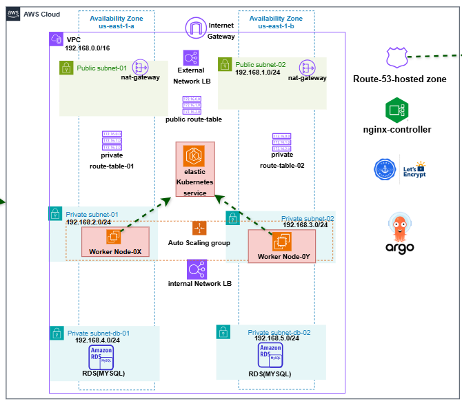

# Terraform EKS & Database Deployment

This repository contains the infrastructure-as-code (IaC) setup using **Terraform** to deploy a complete AWS environment, including VPC, EKS (Kubernetes), RDS database, and DNS. The deployment is automated using **GitHub Actions**.

---


## 📁 Project Structure

```bash
terraform-eks-db/
├── .github/workflows/          # GitHub Actions CI/CD workflows
├── .qodo/                      # Local automation/scripts (optional or internal tooling)
├── docker-git-runner-setup/   # Docker setup for custom GitHub runner (if used)
├── module-database/           # Terraform module to deploy RDS databases
├── module-dns/                # Terraform module for Route53 or other DNS setup
├── module-eks/                # Terraform module to deploy an EKS cluster
├── module-vpc/                # Terraform module to provision VPC and networking
├── .terraform.lock.hcl        # Provider and dependency lock file
├── .tflint.hcl                # Linting configuration for Terraform
├── 01-provider.tf             # AWS provider configuration
├── backend.tf                 # Remote state configuration (e.g., Terraform Cloud/S3)
├── deploy.yaml                # Sample GitHub Actions workflow (deprecated or backup)
├── main.tf                    # Main Terraform entry point that wires all modules
├── output.tf                  # Outputs of the infrastructure
├── readme.MD                  # You are here
├── terraform.tfvars           # Variable values
└── variable.tf                # Variable definitions.
```

## This is the architecture for the infrastruture deployment
# aws-three-tier-Deploy
# aws-three-tier-Deploy
